========================================
SurveyingCalculation plugin for QGIS 2.x
========================================
Tutorial
--------

In this tutorial the functionality of the plugin is demonstrated through 
sample datasets, which can be found in the sample directory after the 
installation of the plugin. To use this tutorial you must have QGIS 2.x
installed on your machine. Linux or Windows operating system can be used.

Enable SurveyingCalculation plugin in QGIS
::::::::::::::::::::::::::::::::::::::::::

Befor using the installed SurveyingCalculation plugin, it has to be enabled in 
QGIS. The installation process of the plugin can be found in the Users's Guide.

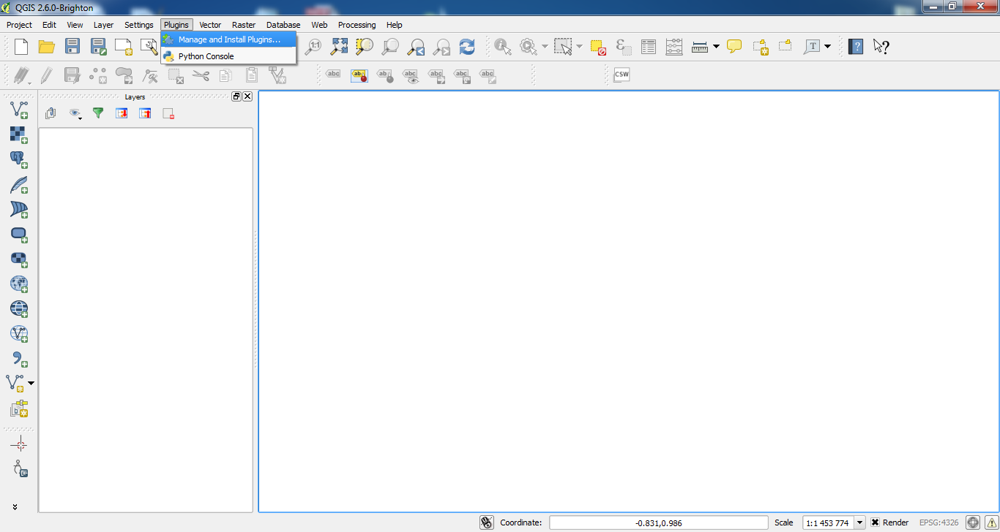

   *(1.) From the Plugins menu select Manage and Install Plugins...*

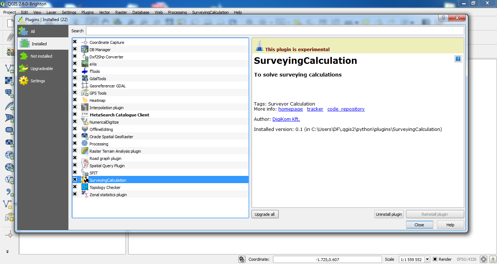

   *(2.) Search for SurveyingCalculation plugin and enable it*

After enabling the plugin a new pulldown menu (SurveyingCalculation) and a
toolbar are visible in the main window of QGIS.

Preparing the work
::::::::::::::::::

The SurveyingCalculation plugin is fully integrated into QGIS. We will use 
QGIS project to save our working environment. Some special data sets must be
added to the project to be able to use the different calculations (e.g.
traversing, network adjustment).

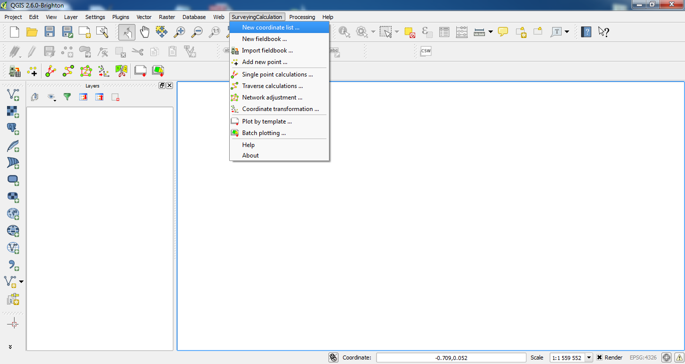

   *(3.) From the SurveyingCalculation menu select New coordinate list ...*

A new empty 2D point shape file is created to store benchmarks (points with
known coordinates). The plugin adds *coord_* to the beginning of the
name to distinguish it from the other elements of the project.
Besides the point identifier, the coordinates (easting, 
northing, elevation), a point code and a point type can be stored in the 
attribute table of the shape file.

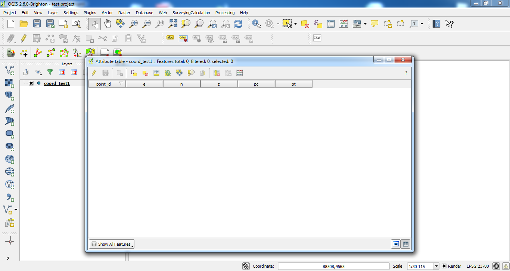

   *(4.) The attribute table of the coordinate file is empty*

To demonstrate the calculations we need some benchmarks and observations.
During the next step an electric fieldbook is imported. Electric fieldbooks 
from total stations can contain observations (direction, distance) and
coordinates too.

For the transparency of the fieldbooks the representation of NULL values should
be changed before importing.

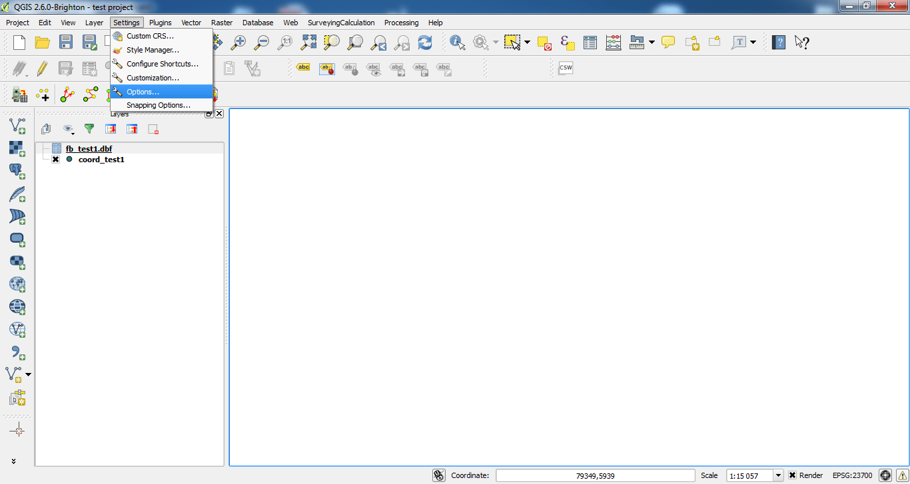

   *(5.) From the Settings menu select Options...*

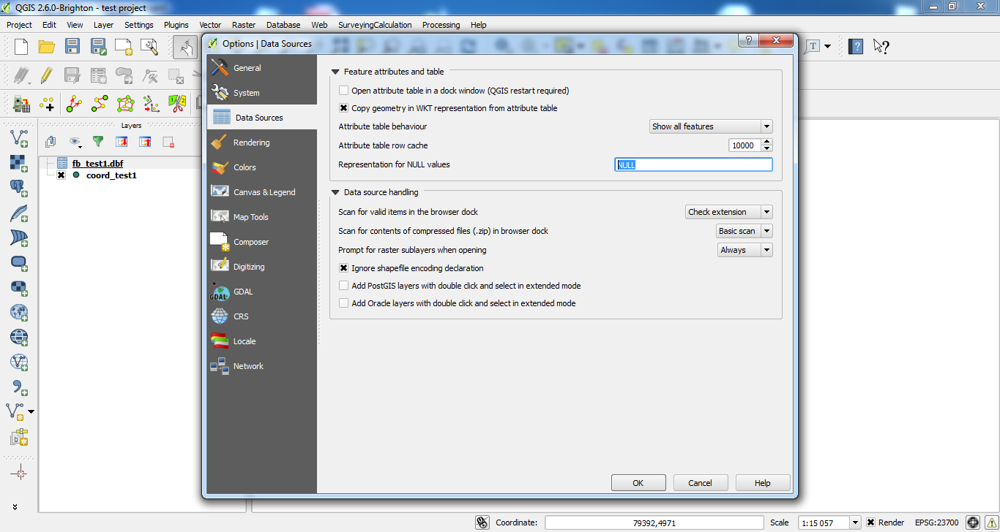

   *(6.) Select Data Sources, and set the Representation for NULL values from "NULL" to empty string*

.. figure:: images/t006.png
   :scale: 80 %
   :align: center

   *(7.) From the SurveyingCalculation menu select Import fieldbook ...*

In the file selection dialog navigate to sample directory of the installed 
plugin, select the *Geodimeter JOB/ARE* file type and the *test1.job* file.
You must give a name and a directory for the imported fieldbook in a second
output file selection dialog. Save the imported observations into the sample 
directory with the name test1. The plugin adds *fb_* to the beginning of the
name to distinguish it from the other elements of the project.

The records of the fieldbook should be ordered by *id* column to get the logical
order of observations. The *id* values are  incremented by ten to left space 
manually added rows.

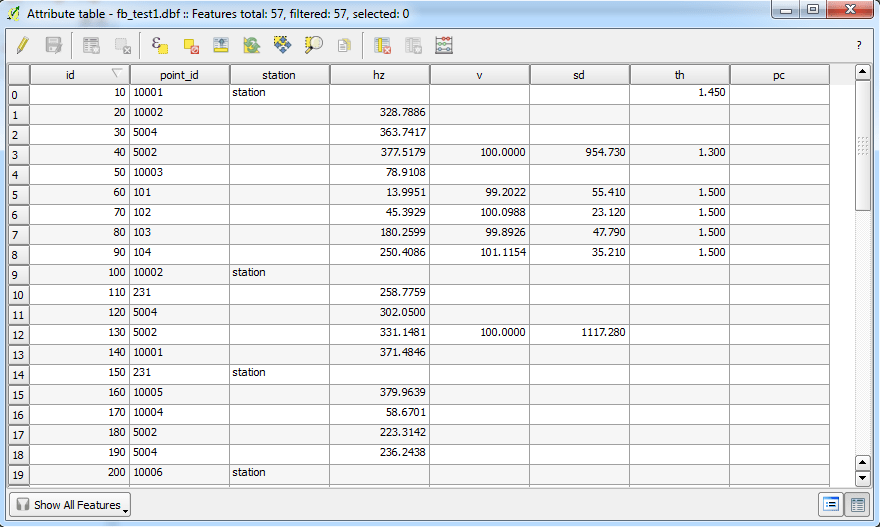

   *(8.) The attribute table of the fieldbook*

**TODO**
*test projec is not a good name for the fieldbook, project has other meaning 
in QGIS! Please rename it to test1. (Zoli)*

The coordinates for the sample project can be imported from the *test1.are* 
file, similiar to the import of the job file. The points are added to the
coordinate list file.

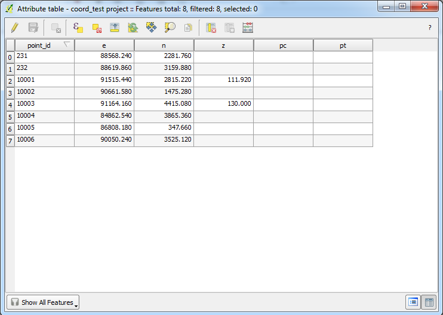

   *(9.) The attribute table of the coordinate file*

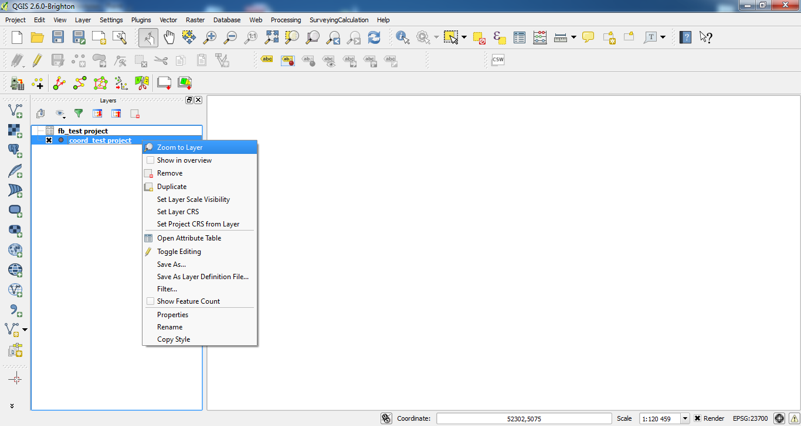

   *(10.) To view the points in the map window, right click on the coordinate file and select Zoom to Layer*

Points can be labeled with *point_id* column in the map window using the 
standard QGIS labelling tools.

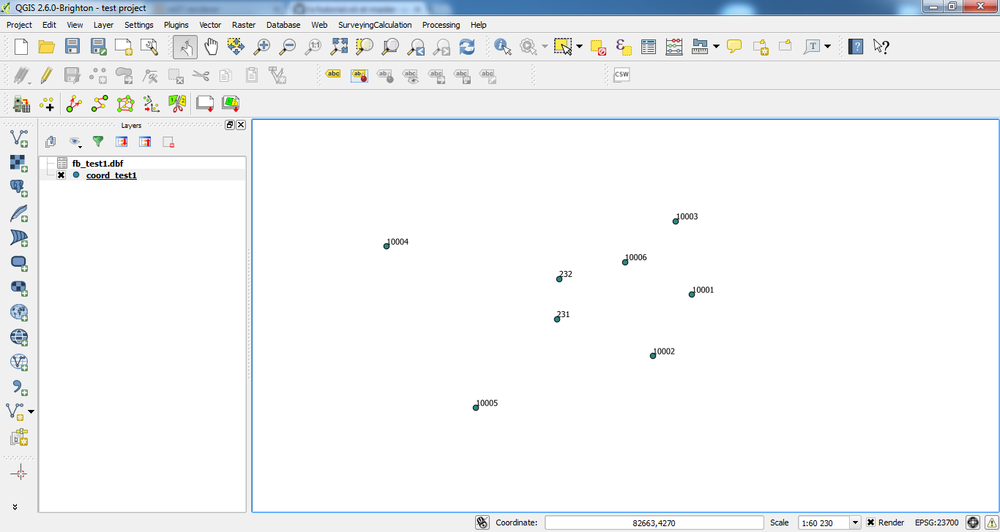

   *(14.) Points labelled with point id in the map window*

**TODO** 
*the figure 14 contains the points 5001-5004, the coordinates of them
is no known at this moment*

QGIS project can be saved by clicking on the save (floppy disk) icon.

Single Point Calculations
:::::::::::::::::::::::::

Now we are able to start the coordinate calculations from the observations.

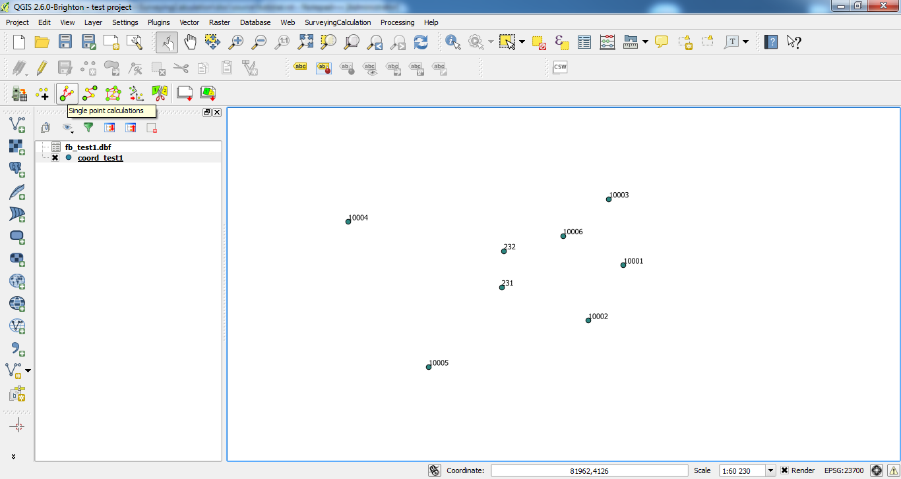

   *(15.) Click Single point calculations icon on SurveyingCalculation toolbar*

**TODO**
*Why aren't the points visible in the map window?*

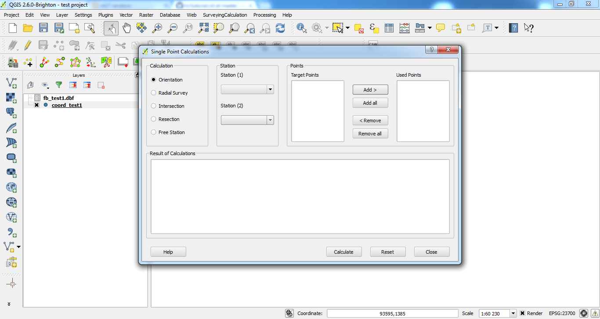

   *(16.) First select the type of calculation*

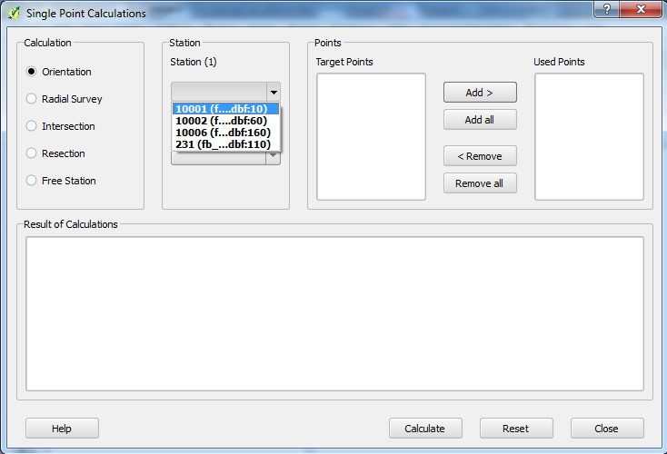

   *(17.) By the orientation select the 10001 station point (the fielbook name and the id in fieldbook are shown in brackets)*

In the *Station (1)* list the fielbook name and the id in fieldbook are shown 
in brackets.

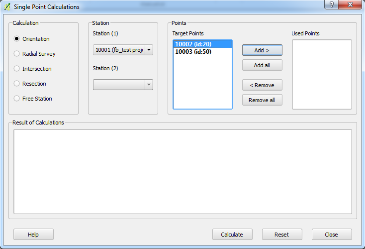

   *(18.) Select one or more target points and add them to used points (the id in fieldbook is shown in bracket)*

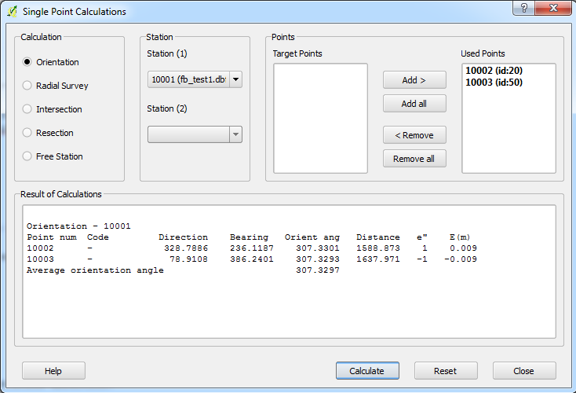

   *(19.) Click Calculate button and the orientation angle will be calculated*

**TODO**
*Why did you select only one orientation direction?*

Results of the calculation can be seen in the *Result of calculations* widget. 
The results are also written to the log file. The name and location of the 
log file can be set in *config.py*.
The orientation angle is stored in the fieldbook in the *hz* column of the 
station row.

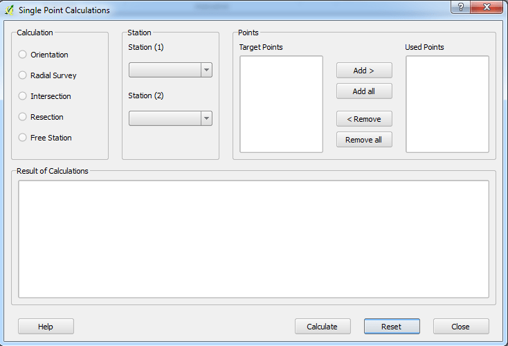

   *(20.) Click Reset button to begin a new calculation*

**TODO**
Why is it neccessary to reset?

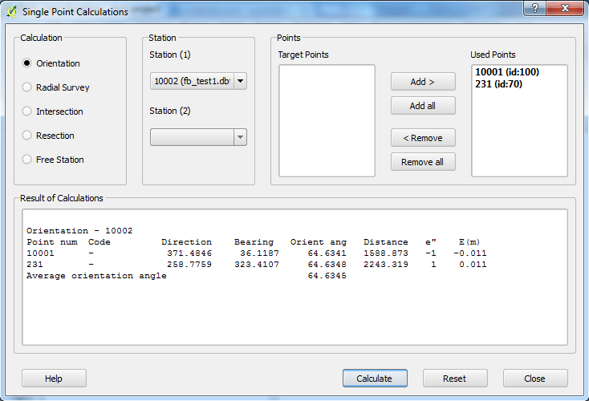

   *(21.) Orientation for 10002 station*

Repeat the orientation calculation for all known stations (231, 10006).

There are observations to point 5002 and 5004 from station 10001 and 10002.
So intersection can be calculated for them.

.. figure:: images/t019.png
   :scale: 80 %
   :align: center

   *(22.) Stating intersection*

By the intersection two oriented stations must be selected in *Station (1)* and
*Station (2)* list.
The fielbook name and the id in fieldbook is shown in brackets in the station 
list.

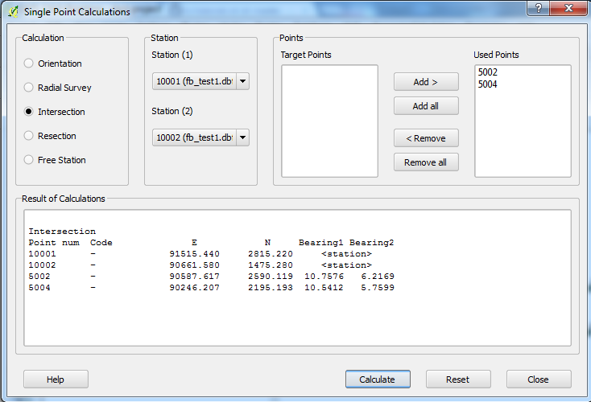

   *(23.) Intersection of point 5004*

Select one or more target points and add them to used point, click calculate 
and coordinates will be calculated. Results of the calculation can be 
seen in the result widget. Calculated coordinates are added to the coordinate 
list too.

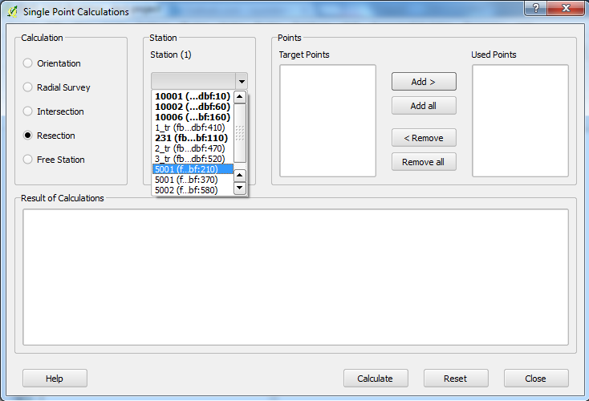

In the next step coordinates of point 5001 and 5003 will be calculated using
resection.

   *(24.) Preparing resection*
   
By the resection select the station 5001 (the fielbook name and the id in 
fieldbook is shown in brackets, known points are displayed in bold face).

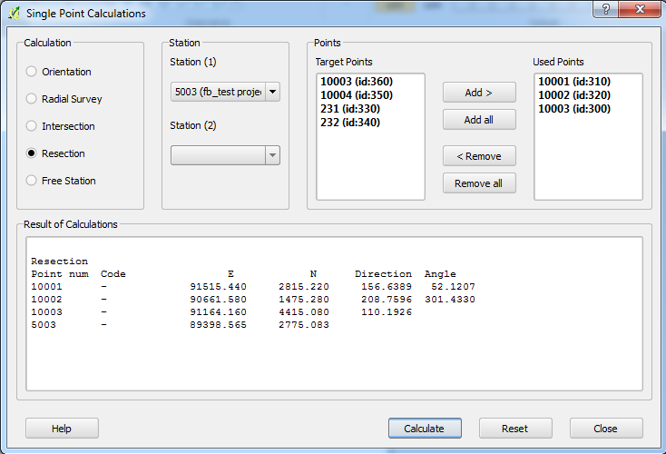

   *(25.) Resection of station 5001*

Select exactly three target points (the id in fieldbook is shown in brackets) 
and add them to the *Used Points* list, click on *Calculate* button and 
coordinates will be calculated. Details of the calculation can be seen in the 
result widget.
Calculated coordinates are added to the coordinate list too.

Please repeat the resection calculation for station 5003.

There are distance measurements from station 5001 to other known points (10001 and 10003). 
Free station calculation can be used to consider all observations (directions
and distances) from a station. Let's calculate the coordinates of station 5001
using free station calculation.

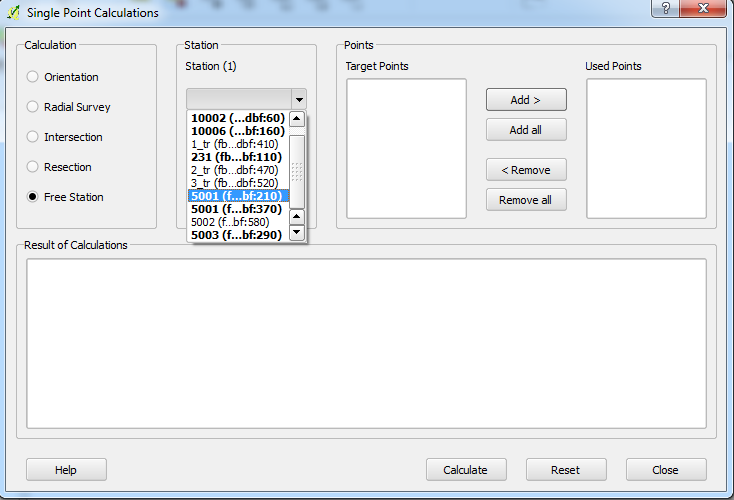

   *(26.) Preparing free station calculation*
   
For the free station calculation select station 5001 (the fielbook name and the
id in fieldbook is shown in brackets, known points are displayed in bold face)
in the *Station (1)* list.

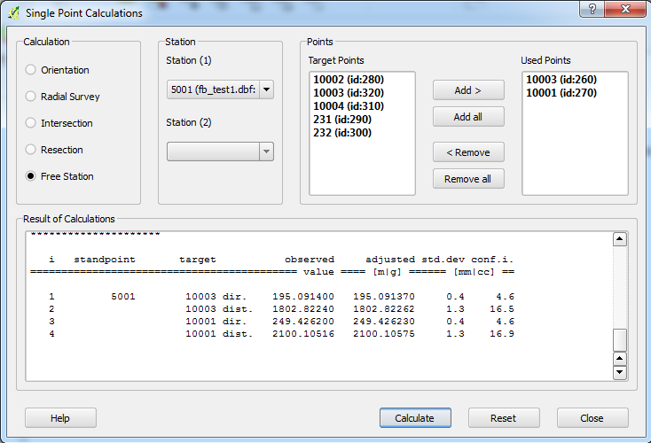

   *(27.) Free station calculation for station 5001*

Select two or more target points (the id in fieldbook is shown in brackets) and add to used points, click calculate and coordinates will be calculated. Details of the calculation can be seen in the result widget.
Free station calculation uses the least quares method. The calculation result
list contains all details about calculation, provided by GNU-Gama project.
Repeat the free station calculation using all possible observations!

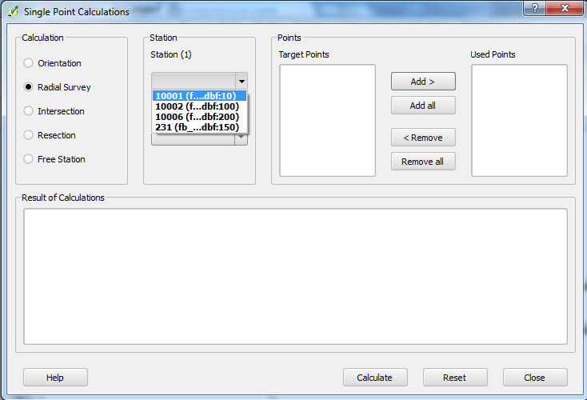

   *(28.) By the radial survey select station point (the fielbook name and the row id in fieldbook is shown in brackets, only known points can be selected)*

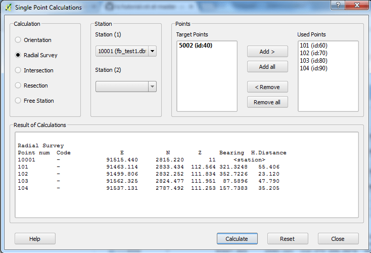

   *(29.) Select one or more target points (the row id in fieldbook is shown in brackets) and add to used points, click calculate and coordinates will be calculated. Parameters of the calculation can be checked in the result window.*

Traverse calculations
:::::::::::::::::::::

If orientation can be calculated on start point or end point, it should be calculated first.

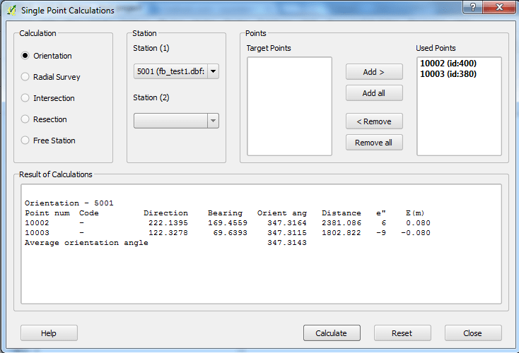

   *(30.) Orientation on start point*

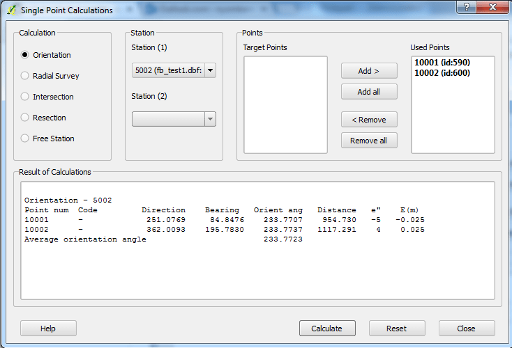

   *(31.) Orientation on end point*

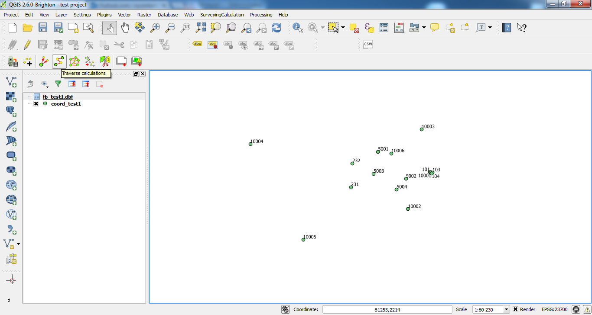

   *(32.) Click Traverse calculations icon on SurveyingCalculation toolbar*

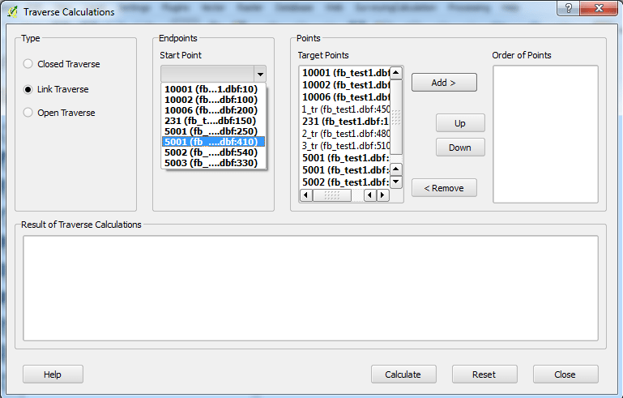

   *(33.) Select the type of traverse and the start point (the fielbook name and the row id in fieldbook is shown in brackets, only known points can be selected)*

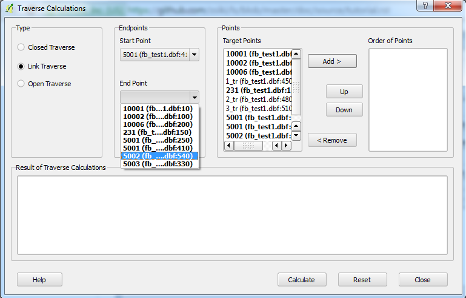

   *(34.) Select the end point (the fielbook name and the row id in fieldbook is shown in brackets, only known points can be selected except open traverse)*

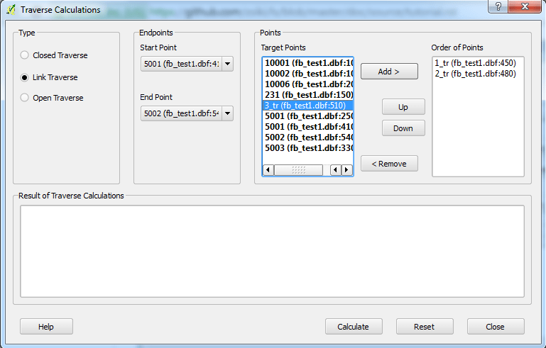

   *(35.) Select target points and add to used points in the right order (the fielbook name and the row id in fieldbook is shown in brackets, known point are displayed bold type)*

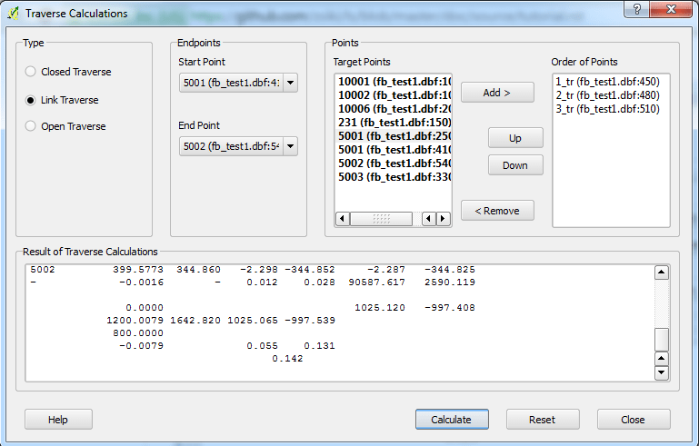

   *(36.) Click calculate and coordinates will be calculated. Parameters of the calculation can be checked in the result window.*

Network adjustment
::::::::::::::::::

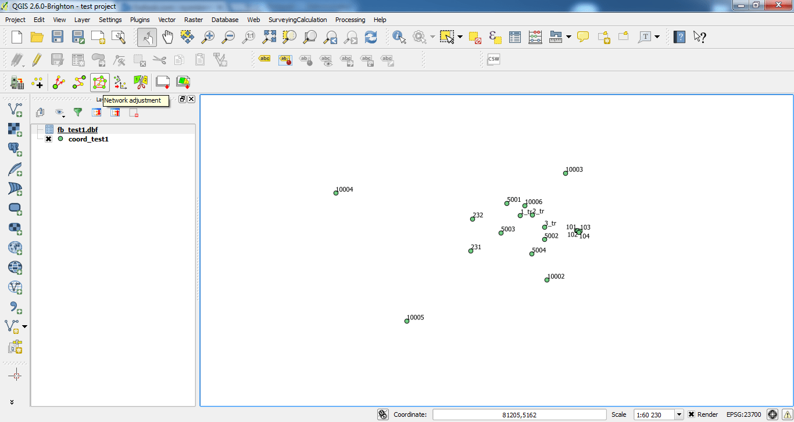

   *(37.) Click Network adjustment icon on SurveyingCalculation toolbar*

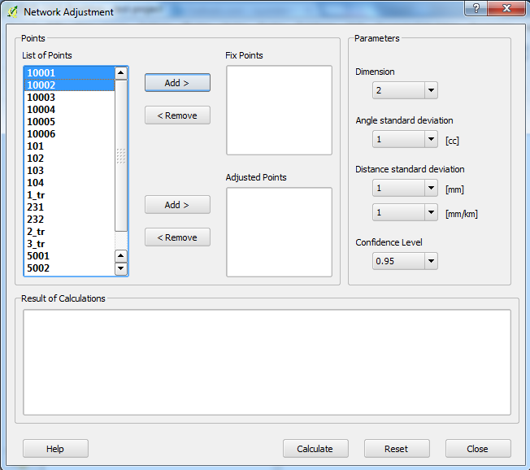

   *(38.) Select the fix points and add to the fix points*

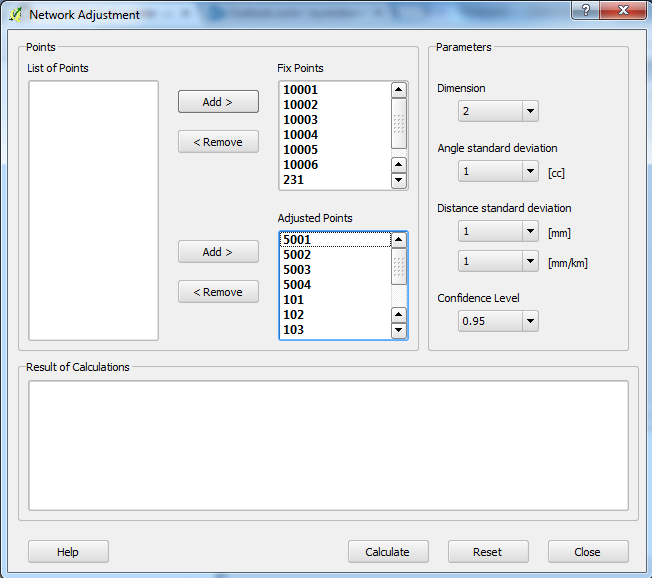

   *(39.) Select points to adjust and add to the adjusted points*

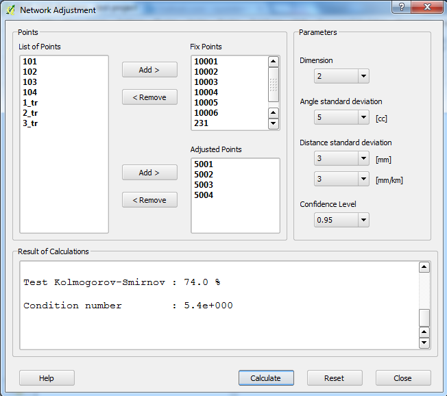

   *(40.) Check the parameters of the adjustment. Click calculate and coordinates will be calculated. Parameters of the calculation can be checked in the result window.*

Coordinate transformation
:::::::::::::::::::::::::

First add the coordinate file containing the points to transformate.

.. figure:: images/t61.png
   :scale: 80 %
   :align: center

   *(41.) Click Add vector layer icon, and select an existing file*

.. figure:: images/t62.png
   :scale: 80 %
   :align: center

   *(42.) Click Layer Labeling Options icon*

.. figure:: images/t63.png
   :scale: 80 %
   :align: center

   *(43.) Turn on labeling and select point_id*

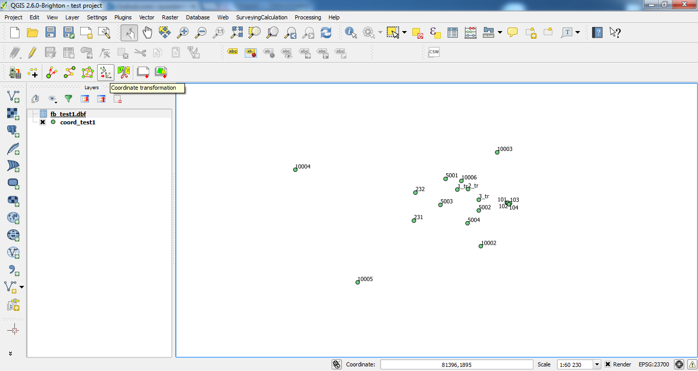

   *(44.) Click Coordinate transformation icon on SurveyingCalculation toolbar*

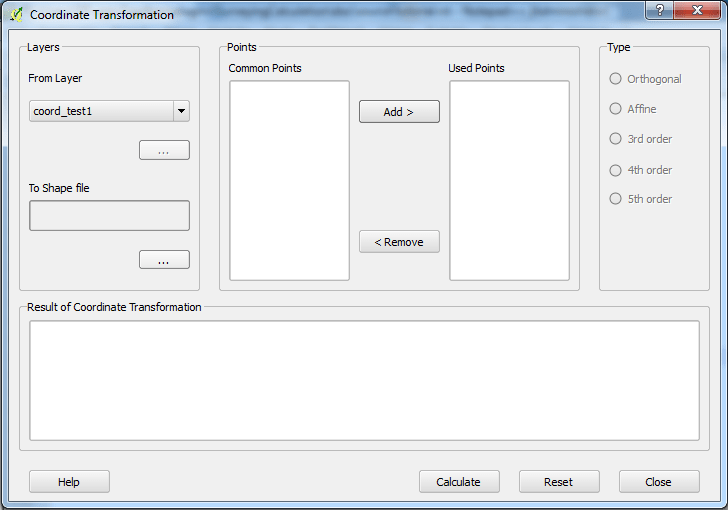

   *(45.) Select the shape file where to transformate. The result points will be written in this shape file.*

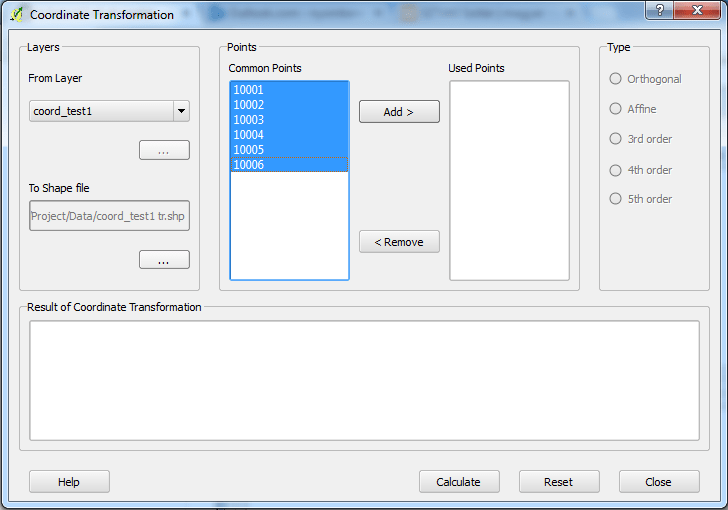

   *(46.) From the common points add the needed points to used points*

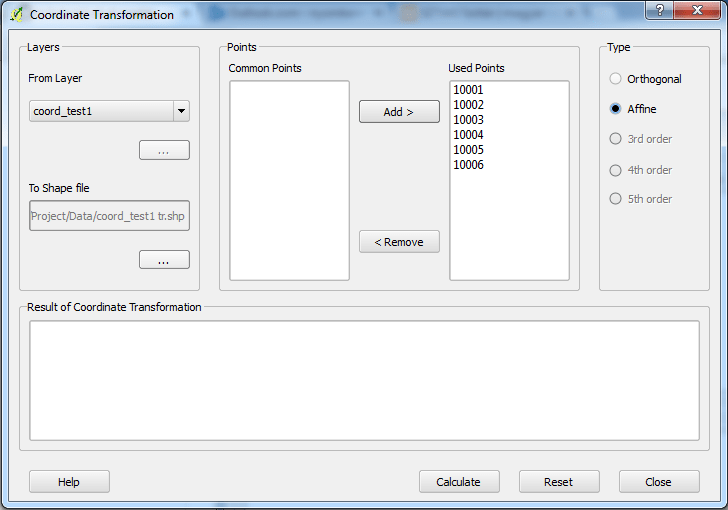

   *(47.) Select the type of transformation (each type can be selected only if enough common points)*

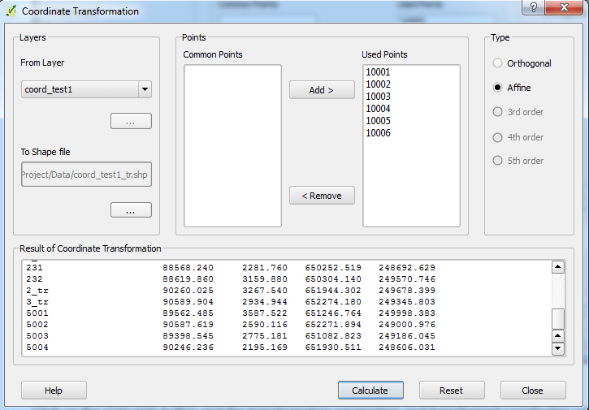

   *(48.) Click calculate and coordinates will be calculated. Parameters of the calculation can be checked in the result window.*

