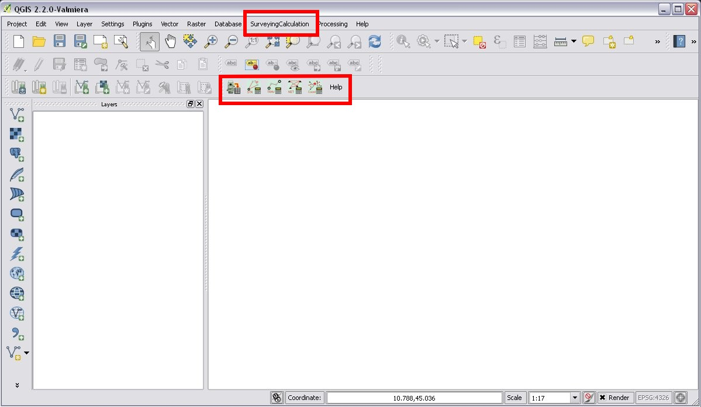
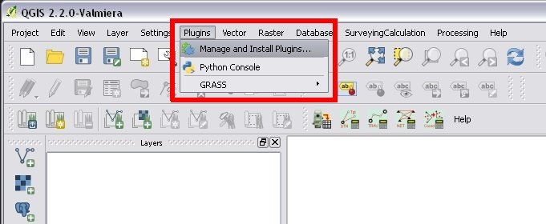
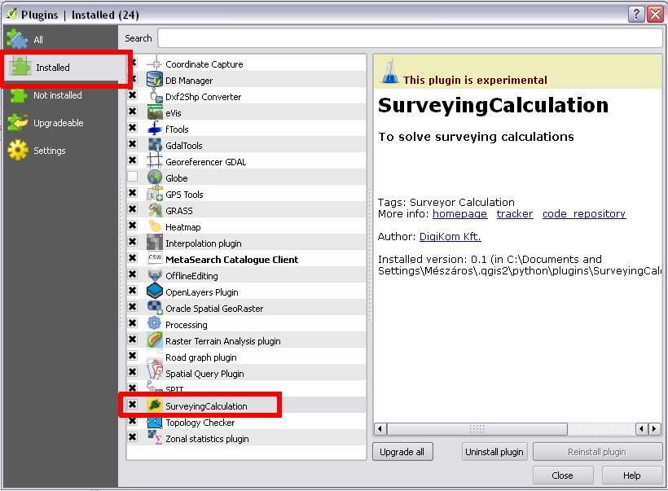
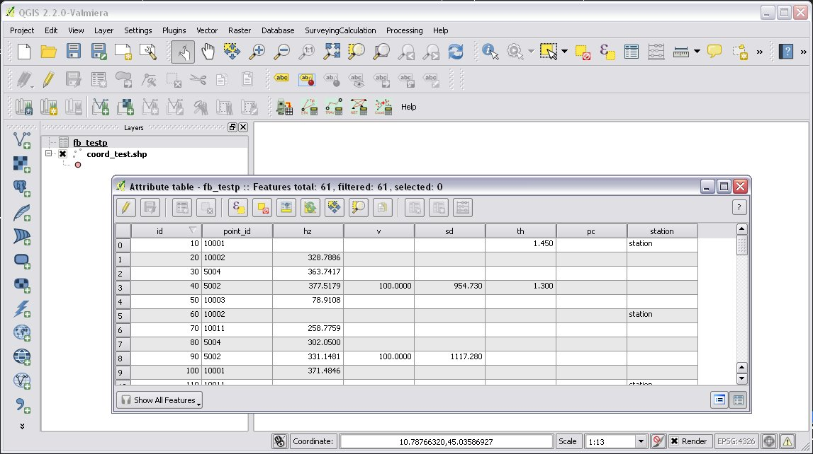
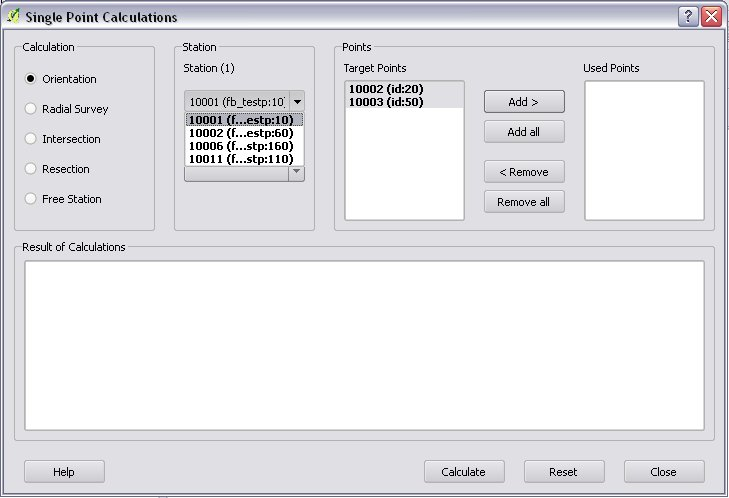
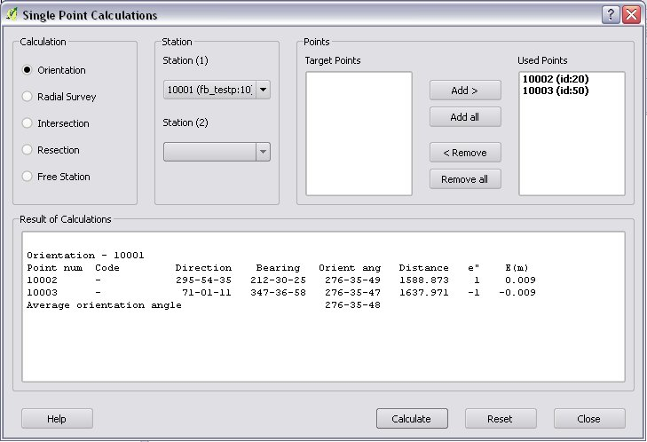
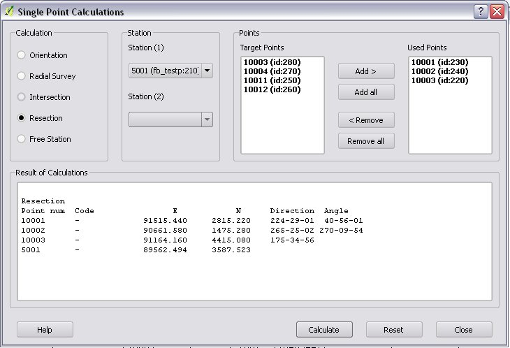

========================================
SurveyingCalculation plugin for QGIS 2.x
========================================
User's Guide
------------

`SurveyingCalculation plugin install`_

`Settings before use`_

`Loading fieldbooks`_
    `Geodimeter JOB/ARE`_

    `Leica GSI`_

    `Sokkia CRD`_
    
`Single Point Calculations`_
    `Orientation`_

    `Radial Survey (Polar Point)`_

    `Intersection`_

    `Resection`_

    `Free Station`_

`Traverse Calculations`_
    `Closed traverse`_

    `Link traverse`_

    `Open traverse`_

`Network adjustment`_

`Coordinate transformation`_

Typographical conventions
::::::::::::::::::::::::

**TODO**

Hardware and software requirements
::::::::::::::::::::::::::::::::::

The SurveyingCalculation plug-in can be used on any computer on which QGIS 
can run. It was tested on Windows 7 and Fedora Linux, but on any other Windows 
versions or Linux distros is should work.

SurveyingCalculation plugin install
:::::::::::::::::::::::::::::::::::

**Installing from GitHub**

If you have Git Client (Git Bash or other clients)

#. git clone from https://github.com/zsiki/ls to *~/.qgis2/python/plugins/SurveyingCalculation* (~ is your home directory on Linux, replace it on Windows)
#. Open QGIS Desktop.

If you don't have Git Clone

#. Download the ZIP file from https://github.com/zsiki/ls to your computer.
#. Unzip to *~/.qgis2/python/plugins/SurveyingCalculation*.
#. Open QGIS Desktop.

**Installing from QGIS Plug-in repo**

#. Start QGIS
#. In the the plug-in dialog enable experiental plugins
#. Look for SurveyingCalculation plug-in and press Install button

After installing the plug-in you must enable it in the *Manage and Install 
Plugins* dialog. After it the menu and the toolbar of the plug-in
will be visible.

   *(1.) SurveyingCalculation plugin in QGIS (menu and toolbar)*

In case of problem, check the plugin in Manage and Install Plugins dialog

Beside installing the plug-in you must also install gama-local (part of the GNU
Gama project) for adjustment calculation.
    

   *(2.) Manage and Install Plugins*
       

Is switched on SurveyingCalculation plugin?

   *(3.) Installed SurveyingCalculation plug-in*

---------------------------------------------

Settings before use
:::::::::::::::::::
Set to empty string the *Representation for NULL values* on the Data sources
tab in the Setting/Options menu. It makes the Attribute Table (Fieldbook) more
readable.

.. figure:: images/04.jpg
   :scale: 80 %
   :align: center

   *(4.) Settings of Attribute Table*

.. figure:: images/05.jpg
   :scale: 80 %
   :align: center

   *(5.) Settings of Attribute Table*

---------------------------------------------

Loading fieldbooks
::::::::::::::::::

#. First you have to open an existing Coordinate list or create a new one from the menu. Otherwise coordinates in the filedbook will be lost.
#. After creating a new Coordinate list shape file, you get an empty table in your project with the following columns (column names and types are mandatory):
        :point_id:    point number
        :e:           East coordinate
        :n:           North coordinate
        :z:           Z coordinate (height)
        :pc:          point code
        :pt:          point type
#. Click on the Load fieldbook icon.
#. Choose the type of fieldbook (`Geodimeter JOB/ARE`_; `Leica GSI`_; `Sokkia CRD`_)

.. figure:: images/06.jpg
   :scale: 80 %
   :align: center

   *(6.) New coordinate list*

.. figure:: images/07.jpg
   :scale: 80 %
   :align: center

   *(7.) Empty coordinate table*

Geodimeter JOB/ARE
++++++++++++++++++
#. Select the JOB file
#. Select the output .dbf file containing your observations, the name will start with *fb_*, the program will add it to the name automatically if neccessary
#. After giving the path to the DBF file a new fieldbook is added to your QGIS project. The name of the fieldbook always starts with "fb\_". This database table stores measurements, it has no graphical (map) data.
        :id:          ordinal number of observation in fieldbook, sort by this field normally
        :point_id:    point number (max 20 characters)
        :station:     if record data belongs to a station it must be *station* otherwise empty
        :hz:          horizontal angle or orientation angle in station record
        :v:           vertical angle
        :sd:          slope distance
        :th:          target height or instrument height in station record
        :pc:          point code
#. After loading the .JOB, you can optionally load the .ARE file in the same way

.. figure:: images/08.jpg
   :scale: 80 %
   :align: center

   *(8.) Load fieldbook*

   *(9.) Fieldbook*

.. figure:: images/10.jpg
   :scale: 80 %
   :align: center

   *(10.) Coordinate table*

   
Leica GSI
+++++++++

See Job loading.

Sokkia CRD
++++++++++

See JOB loading.

Using fieldbook data
::::::::::::::::::::

Angles are displayed in the fieldbook in Grads (Gon) unit with four decimals.
Distances, instrument and target heights are in meters.
TODO: How to change, insert, delete, ...

Single Point Calculations
:::::::::::::::::::::::::

Orientation
+++++++++++
#. Click the Single Point Calculations icon.
#. Select the Orientation from the type of Calculations.
#. Select the Station from the list. You can calculate only the orientation of one station at a time.
#. The Target Points list loads automatically.
#. Add to Used Points list one or more points which ypu would like to use for the orientation. If you would like to change the *Used Points* list, use the Remove button.
#. Click the Calculate button.
#. Result of Calculation displayed automatically in result window.
#. You can change settings in the dialog and press calculate to make another calculation, use the Reset button to reset the dialog to its original state.

   *(11.) Orientation*
       

   *(12.) Result of Orientation*

Radial Survey (Polar Point)
+++++++++++++++++++++++++++
#. Click the Single Point Calculations icon.
#. Select the Radial Survey from the type of Calculations.
#. Select the Station from the list. You can calculate several polar point from the same station at a time.
#. The Target Points list loads automatically.
#. Add to Used Points list one or more points which you would like to calculate coordinates for. If you would like to correct, use the Remove button.
#. Click the Calculate button.
#. Result of Calculation displayed automatically in result window.
#. You can change settings in the dialog and press calculate to make another calculation, use the Reset button to reset the dialog to its original state.

.. figure:: images/13.jpg
   :scale: 80 %
   :align: center

   *(13.) Radial Survey*

Intersection
++++++++++++
#. Click the Single Point Calculations icon.
#. Select the Intersection from the type of Calculations.
#. Select two stations from the Station(1) and Station(2) lists
#. The Target Points list loads automatically. It contains the points, which were measured from both stations.
#. Add to Used Points list one or more points which would like to calculate coordinates. If you would like to correct, use the Remove button.
#. Click the Calculate button.
#. Result of Calculation prints automatically in result window.
#. You can change settings in the dialog and press calculate to make another calculation, use the Reset button to reset the dialog to its original state.

.. figure:: images/14.jpg
   :scale: 80 %
   :align: center

   *(14.) Intersection*

Resection
+++++++++
#. Click the Single Point Calculations icon.
#. Select the Resection from the type of Calculations.
#. Select the station from Station (1) list.
#. The Target Points list loads automatically. The list contains the points, which were measured from the station. You can calculate only one station coordinates at a time.
#. Add three points to the Used Points list which will be used for resection. If you would like to correct, use the Remove button.
#. Click the Calculate button.
#. Result of Calculation prints automatically in result window.
#. You can change settings in the dialog and press calculate to make another calculation, use the Reset button to reset the dialog to its original state.

       
   *(15.) Resection*

       
Free Station
++++++++++++

Traverse Calculations
:::::::::::::::::::::

Closed traverse
+++++++++++++++

Link traverse
+++++++++++++

Open traverse
+++++++++++++

Network adjustment
::::::::::::::::::

Coordinate transformation
:::::::::::::::::::::::::

       
       
       
       
