=========================================================
User's Guide for SurveyingCalculation plugin for QGIS 2.x
=========================================================

The SurveyingCalculation plugin was created by the `DigiKom Ltd (Hungary) 
<www.digikom.hu>`_. It was supported by the SMOLE II for Niras Finland Oy.
It was developped for the Land Parcel Cadastre of Zanzibar.

Typographical conventions
:::::::::::::::::::::::::

**TODO**

Hardware and software requirements
::::::::::::::::::::::::::::::::::

The SurveyingCalculation plug-in can be used on any computer on which QGIS 2.x
can run. It was tested on Windows 7 and Fedora Linux, but on other Windows 
versions or Linux distros it should work. QGIS version 2.2, 2.4 and 2.6 were 
used for testing the plugin.

The network adjustment and the free station calculation in the plug-in is base 
on the GNU Gama open source project. `GNU Gama <https://www.gnu.org/software/gama/>`_ must be installed separatelly to use these calculations.

Installation of the SurveyingCalculation plugin
:::::::::::::::::::::::::::::::::::::::::::::::

**Installing from QGIS Plug-in repo**

#. Start QGIS
#. In the the plug-in dialog enable experiental plugins (after evaluating the plugin by the QGIS community it will be changed to standard (non experimental) plugin)
#. Look for SurveyingCalculation plug-in in the list of *All* or *Not installed* list and press Install button

**Installing from GitHub**

If you have a Git client on your machine (Git Bash or other clients)

#. git clone from https://github.com/zsiki/ls to *~/.qgis2/python/plugins/SurveyingCalculation* (~ is your home directory on Linux, replace it on Windows)
#. Open the QGIS Desktop

If you don't have a Git client

#. Download the ZIP file from https://github.com/zsiki/ls to your computer
#. Unzip it to *~/.qgis2/python/plugins/SurveyingCalculation*
#. Open the QGIS Desktop

After installing the plug-in you must enable it in the *Manage and Install 
Plugins* dialog. After it the menu and the toolbar of the plug-in
will be visible.

.. figure:: images/u01.png
   :scale: 80 %
   :align: center

   *(1.) Manage and Install Plugins*

Is the SurveyingCalculation plugin switched on?

.. figure:: images/u02.png
   :scale: 80 %
   :align: center

   *(2.) Installed SurveyingCalculation plug-in*

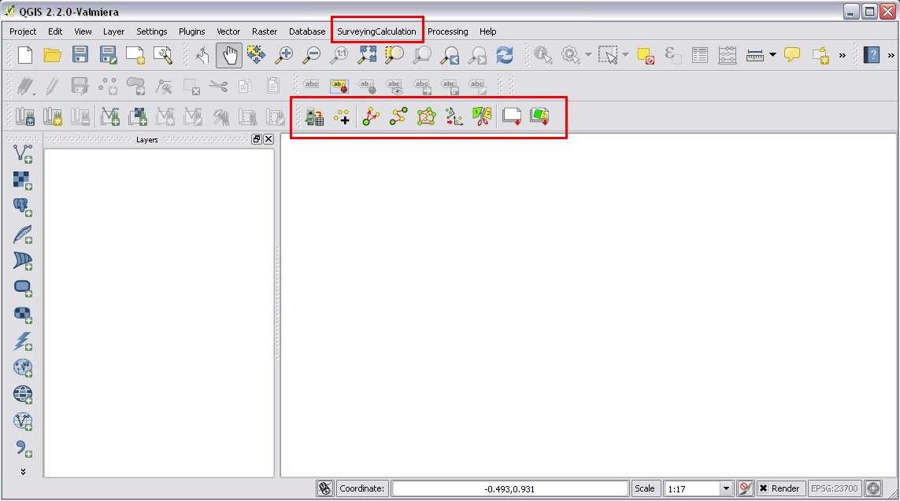

   *(3.) SurveyingCalculation plugin in QGIS (menu and toolbar)*

**GNU Gama project: gama-local**

Beside installing the plug-in you must also install gama-local (part of the GNU
Gama project) for adjustment calculations. See: https://www.gnu.org/software/gama

Settings before use
:::::::::::::::::::

Settings described in this section are optional.

Set the default coordinate reference system (CRS) for new projects and
new layers on the *CRS* tab in the Setting/Options menu to the local CRS. 

Set to empty string the *Representation for NULL values* on the Data sources
tab in the Setting/Options menu. It makes the Attribute Table (Fieldbook) more
readable.

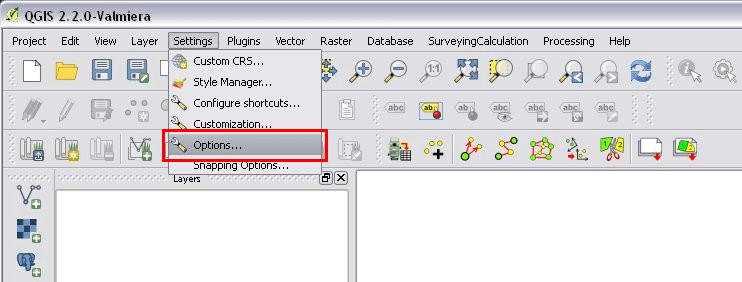

   *(4.) Settings of Attribute Table*

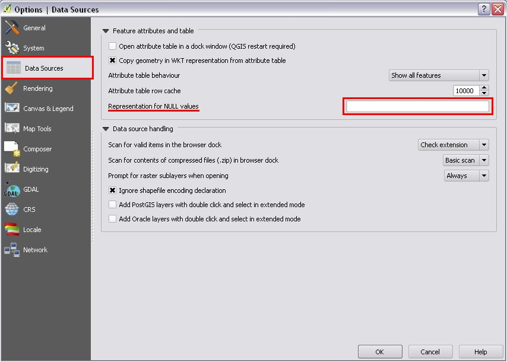

   *(5.) Settings of Attribute Table*

Most of the cases you need an open coordinate list to store calculation results.
Open an existing QGIS project which contains a coordinate list (a point shape
file which name must stat with *coord\_*) or create a new project and add an
existing coordinate list to the project by the add vector layer icon or create 
a new project and create a new coordinate list from the *SurveyingCalculation/New coordinate list ...* menu.

Check the coordinate reference system (CRS) of your coordinate list (*properties* from the popup menu of the layer) and the map.

After loading an existing one or creating a new Coordinate list shape file, you get
a point layer in your project with the following columns in the attribute table
(column names and types are mandatory):

        :point_id:    point number (string 20)
        :e:           East coordinate (number 12.3)
        :n:           North coordinate (number 12.3)
        :z:           Z coordinate (elevation) (number 8.3)
        :pc:          point code (string 20)
        :pt:          point type (string 20)

The first three columns (*point_id*, *e* and *n*) are obligatory, you must fill them.
You mustn't rename or erase these columns but you can add new columns to the attribute table.

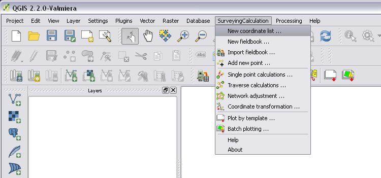

   *(6.) New coordinate list*

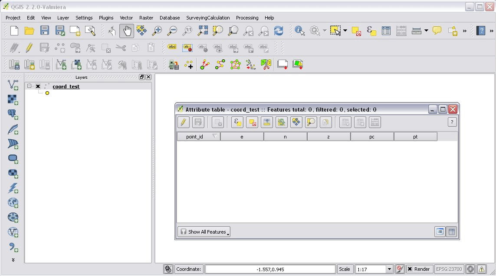

   *(7.) Empty coordinate table*

Only one coordinate list should be open in a project at a time.

Importing fieldbooks
::::::::::::::::::::

Observations made by total stations and GPS are stored in electric fieldbooks.
The files storing the fieldbook data must be downloaded to the computer before
you can use them in the plug-in. Different fieldbook types are supported:

- Leica GSI 8/16
- Geodimeter JOB/ARE
- Sokkia CRD
- SurvCE RW5
- STONEX DAT

Any number of electric fieldbooks can be opened/loaded into a QGIS project.
You can even create a new empty fieldbook and fill it manually.

#. There must be az open coordinate list in your actual project (a point layer which name starts with *coord\_*). Otherwise coordinates read from the filedbook will be lost
#. Click on the Load fieldbook icon or select it from the *SurveyingCalculation* menu
#. Choose the type of the fieldbook (`Geodimeter JOB/ARE`_; `Leica GSI`_; `Sokkia CRD`_, `SurvCE RW5`_, `STONEX DAT`_)
#. Select the output DBF file where your observations will be stored, the name will start with *fb_*, the program will add it to the name automatically if you forget
#. After giving the path to the DBF file a new fieldbook is added to your QGIS project. The name of the fieldbook always starts with "fb\_". This database table stores measurements only, it has no graphical (map) data. Fields in the table:

        :id:          ordinal number of observation in fieldbook, sort by this field normally
        :point_id:    point number (max 20 characters)
        :station:     if record data belongs to a station it must be *station* otherwise empty
        :hz:          horizontal angle or orientation angle in station record
        :v:           vertical angle
        :sd:          slope distance
        :th:          target height or instrument height in station record
        :pc:          point code

You musn't change the name of columns or erase them, but you can add new columns
to the table.

The loader adds an extra column to the observation data, the id column, sorting 
the table by this column gives the right order of the observations.

You can create an empty fieldbook for manual input using the *Create fieldbook*
from the SurveyingCalculation menu.

.. figure:: images/u08.png
   :scale: 80 %
   :align: center

   *(8.) Import fieldbook menu*

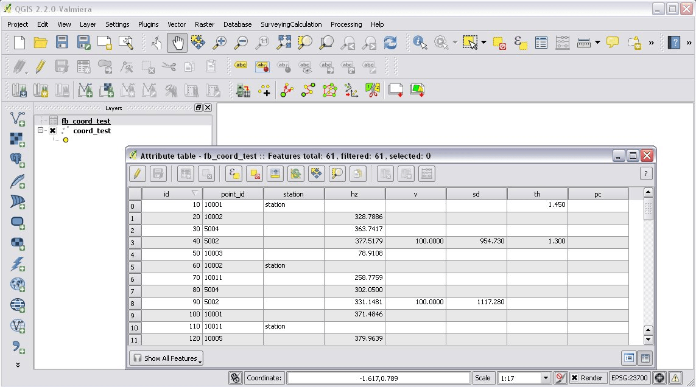

   *(9.) Fieldbook attribute window*

.. figure:: images/u10.png
   :scale: 80 %
   :align: center

   *(10.) Coordinate list*

Leica GSI
+++++++++

Both the 8 byte and 16 byte GSI files are supported. As there is no standard
markers for station start in GSI files, you can use code block to mark a new
station in observations or you must have a record with station coordinates or
instrument height to mark a start of a new station.

Code block to mark the start of a station:

::

    410001+00000002 42....+12012502 43....+00001430

410001+00000002
    Code 2, start of a new station

42....+12012502
    Station id is 12012502

43....+00001430 
    Instument height 1.430 m (optional)

Data codes handled, loaded from GSI:

    :11: point id
    :21: horizontal angle (hz)
    :22: vertical angle (v)
    :31: slope distance (sd)
    :41: code block
    :42: station id
    :43: station height
    :71: point code (pc)
    :81: easting
    :82: northing
    :83: elevation
    :84: easting of station
    :85: northing of station
    :86: elevation of station
    :87: target height (th)
    :88: station height (overwrites 43 code)

The different units in the electric fieldbook are converted to GON and meters
during the import.

Geodimeter JOB/ARE
++++++++++++++++++

JOB and ARE are separate data files. Observations and optionally coordinates are stored in JOB file. Only coordinates are stored in ARE file.
After loading a .JOB, you can optionally load an .ARE file in the same way.

Data codes handled, loaded from JOB/ARE:

    :2: station id
    :3: instrument height
    :4: point code (pc)
    :5: point id
    :6: target height (th)
    :7: horizontal angle (hz)
    :8: zenith angle (v)
    :9: slope distance (sd)
    :23: units
    :37: northing
    :38: easting
    :39: elevation
    :62: orientation point id

The different units in the electric fieldbook are converted to GON and meters
during the import.

Sokkia CRD
++++++++++

Sokkia CRD loader can handle two softly different file format SDR33 and SDR20.

Data records handled, loaded from CRD:

    :00: header record
    :02: station record
    :03: target height
    :08: coordinates
    :09: observations

The different units in the electric fieldbook are converted to GON and meters
during the import.

SurvCE RW5
++++++++++

The SurvCE program RW5 format can store total station and GPS observations.
Both type of data can be loaded into QGIS.

Data records handled, loaded from CRD:

    :GPS: latitude, longitude from GPS receiver
    :--GS/SP: projected coordinates (ovewrites latitude, longitude)
    :OC: station record
    :TR/SS/BD/BR/FD/FR: observation record
    :BK: orientation record
    :LS: instrument height and target height record
    :MO: units record

The different units in the electric fieldbook are converted to GON and meters
during the import.

STONEX DAT
++++++++++

Unfortunatelly we had no description for this fieldbook format, we reverse engineered information from the sample file we got.
GON angle units and meters are supposed for the data in the DAT file.

Data records handled, loaded from DAT:

    :K: station and orientation angle
    :E: observation record
    :B/C: coordinate record
    :L: orientation direction record

Using fieldbook data
::::::::::::::::::::

Angles are displayed in the fieldbook in Grads (Gon) units with four decimals.
Distances, instrument and target heights are in meters.

Sort the fieldbook by the id column, to have the right order of observations.

It is possible to change the fieldbook, insert and delete feature. You can use
the standard QGIS tools to change or extend fieldbook data. Open the 
fieldbook Attribute Table, turn on *Toggle Editing Mode*.

**Insert record**: Click the *Add feature* button and fill in the record. Use the
right id (first column) for the row to get the right position in the fieldbook.

**Delete record**: Select the record to be deleted and click on the *Delete selected features* button.

**Update record**: Double click on the field you want to change and edit the field

After editing the fieldbook data you have to save the changes, click the Save Edits or Toggle Editing Mode button.

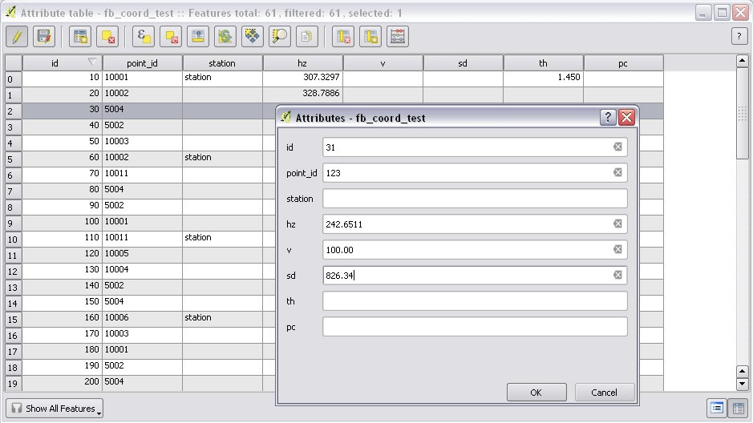

   *(11.) Add feature to Fieldbook*

Add new point to the Coordinate list
::::::::::::::::::::::::::::::::::::

In the *Add new point* dialog you can manually add new point to the coordinate list. The *Add new point* dialog can be opened for the *SurveyingCalculation* menu.
Use the *Add* button if you would like to add more points. The *Add* button saves the new point and clears the form.
The *Close* button saves the new point and closes the dialog window.

.. figure:: images/u12.png
   :scale: 80 %
   :align: center

   *(12.) Add new point to the Coordinate list*

Single Point Calculations
:::::::::::::::::::::::::

In the single calculation dialog you can calculate coordinates of single points
using trigonometric formulas.

Orientation
+++++++++++

#. Click the Single Point Calculations icon.
#. Select the Orientation from the type of Calculations.
#. Select the Station from the list. You can calculate only the orientation of one station at a time.
#. The Target Points list loads automatically.
#. Add to Used Points list one or more points which ypu would like to use for the orientation. If you would like to change the *Used Points* list, use the Remove button.
#. Click the Calculate button.
#. Result of Calculation displayed automatically in result window.
#. You can change settings in the dialog and press calculate to make another calculation, use the Reset button to reset the dialog to its original state.

.. figure:: images/u14.png
   :scale: 80 %
   :align: center    

   *(14.) Orientation*
       

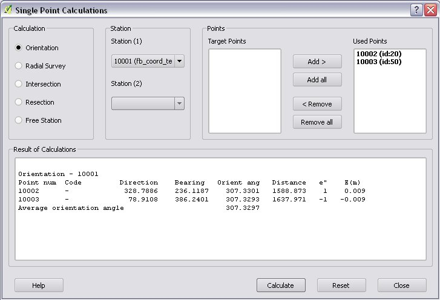

   *(15.) Result of Orientation*

Radial Survey (Polar Point)
+++++++++++++++++++++++++++

Elevation is calculated for polar points if the instrument height and the
station elevation are given.

#. Click the Single Point Calculations icon.
#. Select the Radial Survey from the type of Calculations.
#. Select the Station from the list. You can calculate several polar point from the same station at a time.
#. The Target Points list loads automatically.
#. Add to Used Points list one or more points which you would like to calculate coordinates for. If you would like to correct, use the Remove button.
#. Click the Calculate button.
#. Result of Calculation displayed automatically in result window.
#. You can change settings in the dialog and press calculate to make another calculation, use the Reset button to reset the dialog to its original state.

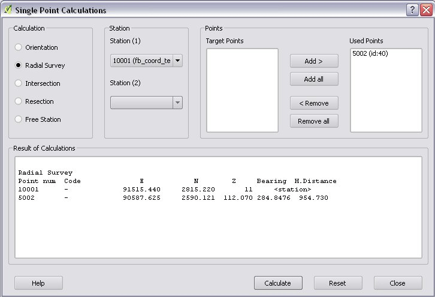

   *(16.) Radial Survey*

Intersection
++++++++++++
#. Click the Single Point Calculations icon.
#. Select the Intersection from the type of Calculations.
#. Select two stations from the Station(1) and Station(2) lists
#. The Target Points list loads automatically. It contains the points, which were measured from both stations.
#. Add to Used Points list one or more points which would like to calculate coordinates. If you would like to correct, use the Remove button.
#. Click the Calculate button.
#. Result of Calculation prints automatically in result window.
#. You can change settings in the dialog and press calculate to make another calculation, use the Reset button to reset the dialog to its original state.

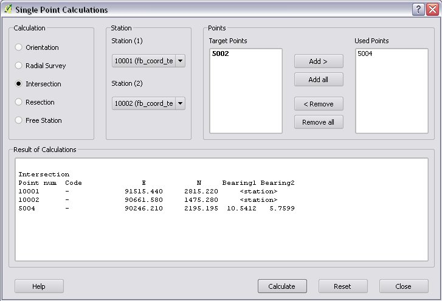

   *(17.) Intersection*

Resection
+++++++++
#. Click the Single Point Calculations icon.
#. Select the Resection from the type of Calculations.
#. Select the station from Station (1) list.
#. The Target Points list loads automatically. The list contains the points, which were measured from the station. You can calculate only one station coordinates at a time.
#. Add three points to the Used Points list which will be used for resection. If you would like to correct, use the Remove button.
#. Click the Calculate button.
#. Result of Calculation prints automatically in result window.
#. You can change settings in the dialog and press calculate to make another calculation, use the Reset button to reset the dialog to its original state.

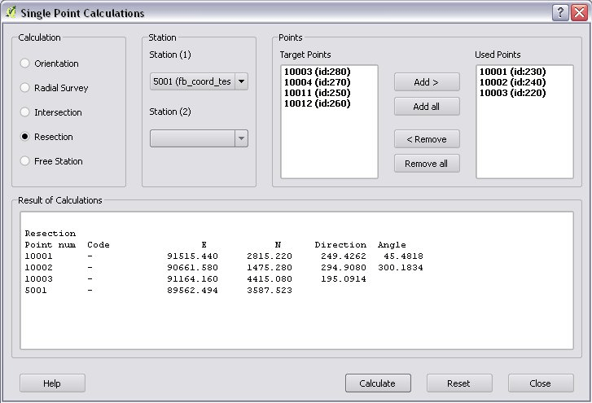
       
   *(18.) Resection*

       
Free Station
++++++++++++
#. Click the Single Point Calculations icon.
#. Select the Free Station from the type of Calculations.
#. Select the station from Station (1) list.
#. The Target Points list loads automatically. The list contains the points, which were measured from the station. You can calculate only one station coordinates at a time.
#. Add two or more points to the Used Points list which will be used for calculate. If you would like to correct, use the Remove button.
#. Click the Calculate button.
#. Result of Calculation prints automatically in result window.
#. You can change settings in the dialog and press calculate to make another calculation, use the Reset button to reset the dialog to its original state.

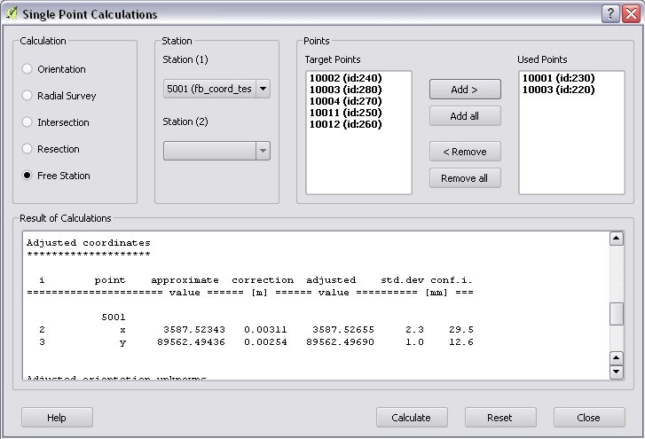
       
   *(19.) Free Station - Adjusted coordinates*

Traverse Calculations
:::::::::::::::::::::

It is possible to calculate three types of Traverse.

#. **Closed traverse**: Closed (polygonal or loop) traverse starts and finishes on the same known point.
#. **Link traverse**: A closed link traverse joins two known points.
#. **Open traverse**: An open (free) traverse starts on a known point and finishes on an unknown point.

How can I use?

#. Click the Traverse Calculations icon.
#. Select the type of Traverse Calculation from the list.
#. Select the Endpoint from Start Point list.
#. If necessary select the Endpoint from End Point list.
#. The Target Points list loads automatically. The list contains the points, which were measured from the station.
#. Add points of Traversing from Target Points list one by one to Order of Points list.
#. The Order can be changed with Up and Down button. If you would like to correct, use the Remove button.
#. Click the Calculate button.
#. Result of Calculation prints automatically in result window.
#. You can change settings in the dialog and press calculate to make another calculation, use the Reset button to reset the dialog to its original state.

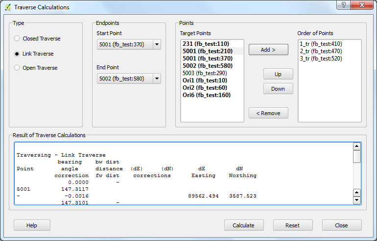
       
   *(20.) Traverse Calculation - Link traverse*

Network adjustment
::::::::::::::::::
#. Click the Network adjustment icon.
#. Select the fix points from List of Points and add to the Fix points list.
#. Select points to adjust from List of Points and add to the Adjusted points.
#. Check the parameters of the adjustment.
#. If you would like to correct, use the Remove button.
#. Click the Calculate button.
#. Result of Calculation prints automatically in result window. Parameters of the Adjustment can be checked in the result window.
#. You can change settings in the dialog and press calculate to make another calculation, use the Reset button to reset the dialog to its original state.

.. figure:: images/u21.png
   :scale: 80 %
   :align: center
       
   *(21.) Traverse Calculation - Link traverse*

Coordinate transformation
:::::::::::::::::::::::::
It is possible to calculate five types of Transformation. Each Transformations work, if you selected enough common points.

#. First add the coordinate file containing the points to transformate. Use the Add layer icon.
#. Click the Coordinate transformation icon.
#. The From Layer field automatically loaded.
#. Select the shape file where to transformate. The result points will be written in this shape file.
#. Add the used points from Common Points list to Used Points list.
#. Select the type of transformation.
#. If you would like to correct, use the Remove button.
#. Click the Calculate button.
#. Result of Calculation prints automatically in result window. Parameters of the Transformation can be checked in the result window.
#. You can change settings in the dialog and press calculate to make another calculation, use the Reset button to reset the dialog to its original state.

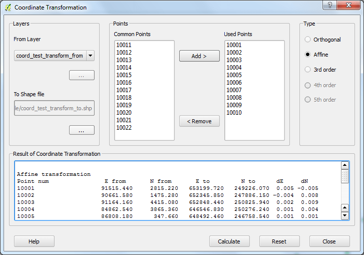
       
   *(22.) Coordinate transformation - Affine transformation*

       
Polygon division
::::::::::::::::    

In Area Division dialog window you can divide parcel (area, polygon etc.). The Division is possible *Paralel to the given line*, or
*Through the first given point* with size of the area.

#. Turn on *Toggle Editing Mode*.
#. Select a parcel, which you want to divide.
#. Click on the *Polygon Division* icon in the *SurveyingCalculation* toolbar.
#. Holding down the right mouse button, draw a line where would you like to divide the area.
#. After drawing the dialog window appear automatically.
#. Set the type of Division and click the *Divide* button.

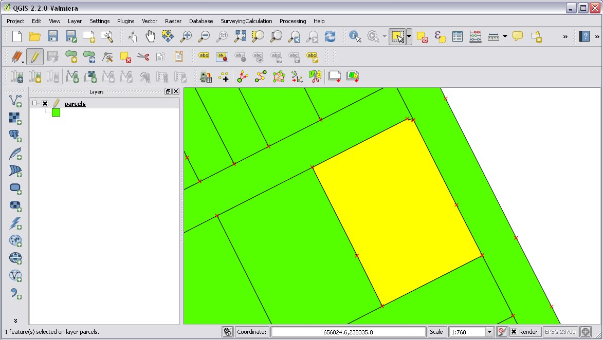
       
   *(23.) Polygon division - Selected polygon to division*

.. figure:: images/u24.png
   :scale: 80 %
   :align: center
       
   *(24.) Polygon division - Area Division*

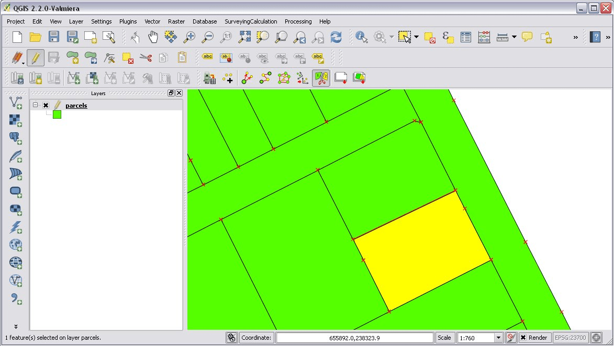
       
   *(25.) Polygon division - Divided polygon*

Plot
::::

Plot by Template
++++++++++++++++

Batch plotting       
++++++++++++++
